# Robuchan


Recipe adaptation fine-tuning for the Mistral AI Worldwide Hackathon Tokyo (Feb 28 - Mar 1, 2026).

Fine-tune `mistral-small-latest` on synthetic dietary recipe adaptations generated from Food.com recipes via `mistral-large-latest`.

No connection to the famous chef [Joel Robuchon](https://en.wikipedia.org/wiki/Jo%C3%ABl_Robuchon).

## Architecture

```mermaid
flowchart LR
    subgraph DataSources["Data Sources"]
        FoodCom["530K recipes"]
        KB["Ingredient swap rules"]
    end

    subgraph DataPipeline["Data Pipeline"]
        Ingest["Ingest & filter recipes"]
        Generate["Generate adapted recipes with Mistral Large"]
        Check["Quality checks"]
        PF{Pass?}
        Drop(["Drop"])
        Dataset[("Training dataset")]
    end

    subgraph Training["Model Training"]
        Upload["Upload dataset"]
        FineTune["Fine-tune Mistral Small"]
        Model[/"Robuchan Model"/]
    end

    subgraph Eval["Evaluation"]
        BaseVsFT["Baseline vs Fine-tuned"]
        Judge["LLM-as-a-judge with Mistral Large"]
        Metrics["W&B"]
    end

    Demo["Interactive demo"]

    FoodCom --> Ingest
    KB --> Check
    Ingest --> Generate
    Generate --> Check
    Check --> PF
    PF -->|fail| Drop
    PF -->|pass| Dataset
    Dataset --> Upload
    Upload --> FineTune
    FineTune --> Model
    Model --> BaseVsFT
    BaseVsFT --> Judge
    Judge --> Metrics
    Model --> Demo
```



## Key Files

| File | What it covers |
|---|---|
| [`PLAN.md`](PLAN.md) | Full 2-day execution plan: timeline, architecture, quality gates, templates, budget |
| [`DATASET_SCHEMA.md`](DATASET_SCHEMA.md) | Internal master format, export contract, scoring definitions, prompt templates |
| [`eval/constraints.json`](eval/constraints.json) | Banned ingredient lists per dietary constraint (9 categories) |
| [`CONSIDERING.md`](CONSIDERING.md) | Dataset strategy decision log and alternatives analysis |
| [`LOG.md`](LOG.md) | Decision audit trail |

## Quick Start

```bash
cp .env.example .env  # add MISTRAL_API_KEY, WANDB_API_KEY, HF_TOKEN
set -a; source .env; set +a
make setup # installs required python and node packages
```

## Credential Quick Check

Verify Mistral key:

```bash
curl -sS https://api.mistral.ai/v1/models \
  -H "Authorization: Bearer $MISTRAL_API_KEY"
```

Verify W&B key:

```bash
curl -sS https://api.wandb.ai/graphql \
  -u "api:$WANDB_API_KEY" \
  -H "Content-Type: application/json" \
  --data '{"query":"query { viewer { id username } }"}'
```

## Fine-tune Scripts

Run dataset preflight checks:

```bash
uv run python train/preflight.py \
  --train-path data/train_filtered.jsonl \
  --valid-path data/valid_filtered.jsonl
```

Upload files and create/start a job:

```bash
uv run python train/finetune.py upload \
  --train-path data/train_filtered.jsonl \
  --valid-path data/valid_filtered.jsonl

uv run python train/finetune.py check-quality-gate \
  --quality-gate-path artifacts/quality_gate_report.json

uv run python train/finetune.py create-job \
  --model mistral-small-latest \
  --training-steps 100 \
  --learning-rate 1e-4 \
  --suffix robuchan-foodcom-synth \
  --wandb-project robuchan

uv run python train/finetune.py start-job
uv run python train/finetune.py wait
uv run python train/finetune.py status --json
```

Job/file IDs are saved to `artifacts/ft_run_manifest.json`.
When `WANDB_API_KEY` is set, W&B tracking is enabled automatically. The project is selected from `--wandb-project`, then `WANDB_PROJECT`, then `robuchan`.
W&B project does not need to be created manually beforehand in most cases; if the API key has permission, the run can create the project on first write.

## Stack

- **Fine-tuning**: Mistral API (cloud, not local)
- **Generation**: `mistral-large-latest` for synthetic training data
- **Eval**: deterministic compliance + LLM-as-judge
- **Tracking**: W&B (auto via Mistral `integrations` + manual eval logging)
- **Demo**: Marimo
- **Deps**: `uv`

## Video generation

```sh
# make changes to demo-video dir, or use remotion skills with claude.
# actual log saved at logs/skill-video-generation.md
make preview
# save a mp4 video
make render
```

If the video does not render below, please see [demo-video/out/video.mp4](demo-video/out/video.mp4).

https://github.com/user-attachments/assets/8ddb7e49-dd24-4684-a5ae-adaaff98c925

## Agent skills usage

Under the Hugging Face Challenge, the following agent skills were used for the development of this project (& the demo video!):


- **[mistake-memory-guardrails](.agents/skills/mistake-memory-guardrails/SKILL.md)**: Required before every repository edit (enforced in `AGENTS.md` + `CLAUDE.md`). Maintained [`AGENT_MISTAKES.md`](AGENT_MISTAKES.md) across sessions. Made data synthesis much faster, by identifying optimizations, patterns in the dataset to reduce API calls, and define static rules.

- **[coding-principles](.agents/skills/coding-principles/SKILL.md)**: Applied when writing and iterating on `data/prepare.py` and `data/audit_dataset.py`. These scripts populated the initial dataset from a Kaggle dataset, generated input data for fine-tuning Mistral models, and validated the data synthesis quality (see [data/gate.log](data/gate.log))

- **[remotion-best-practices](.clause/skills/remotion-best-practices)**: Use for demo video generation. Video at [demo-video/out/video.mp4](demo-video/out/video.mp4), log file at [logs/skill-video-generation.md](logs/skill-video-generation.md).

- **[design-taste-frontend](.agents/skills/design-taste-frontend/)**: Used for fonts, and design choices in the demo.

- **[commit](.agents/skills/commit/SKILL.md)**: Used for all git checkpoints throughout development. Enforced consistent message formatting.

- **[writing-style](.agents/skills/writing-style/SKILL.md)**: Applied to planning and decision documents (`PLAN.md`, `DATASET_SCHEMA.md`, `CONSIDERING.md`, `LOG.md`).
