# Video script

## Team description

Hello, We're Robuchan! (No connection with Joel Robuchon). We help hungry foodies decide their next meal, without having to worry about allergies or dietary restrictions.

## Problem statement

Imagine this. You're Mario, who loves pasta but is gluten-free. Or, you might be Maruti, who wants to try mapo tofu, but can't eat meat! Or, you're Mariko, who wants to make her favorite Japanese dish, but just doesn't have the ingredients she needs. That's where we come in.

## Training one-liner

We finetuned Mistral's {BASELINE} model using a 530K rows dataset, to obtain an accuracy of {IMPRESSIVE_ACCURACY}, beating the baseline's model accuracy of {LOWER_ACCURACY}.

## Result: Statistics

We compared the loss and accuracy of {BASELINE} model with our finetuned model.
{IMAGE_OF_W_AND_B}

## Result: Actual

Let's get Maruti his vegan-friendly mapo tofu.
{CHAT IMAGE, ANIMATED}
<!-- Maruti, I'd like to eat mapo tofu, but I'm a vegetarian -->
<!-- Robuchan: Fear not dear, I'm here.  -->

## Architecture

Our architecture was as follows:

```mermaid
flowchart LR
    subgraph DataSources["Data Sources"]
        FoodCom["530K recipes"]
        KB["Ingredient swap rules"]
    end

    subgraph DataPipeline["Data Pipeline"]
        Ingest["Ingest & filter recipes"]
        Generate["Generate adapted recipes with Mistral Large"]
        Check["Quality checks"]
        PF{Pass?}
        Drop(["Drop"])
        Dataset[("Training dataset")]
    end

    subgraph Training["Model Training"]
        Upload["Upload dataset"]
        FineTune["Fine-tune Mistral Small"]
        Model[/"Robuchan Model"/]
    end

    subgraph Eval["Evaluation"]
        BaseVsFT["Baseline vs Fine-tuned"]
        Judge["LLM-as-a-judge with Mistral Large"]
        Metrics["W&B"]
    end

    Demo["Interactive demo"]

    FoodCom --> Ingest
    KB --> Check
    Ingest --> Generate
    Generate --> Check
    Check --> PF
    PF -->|fail| Drop
    PF -->|pass| Dataset
    Dataset --> Upload
    Upload --> FineTune
    FineTune --> Model
    Model --> BaseVsFT
    BaseVsFT --> Judge
    Judge --> Metrics
    Model --> Demo
```

## Development

This project would not have been possible with agents, who helped make this video too ! More information on our README. Now, what are you hungry for ?
